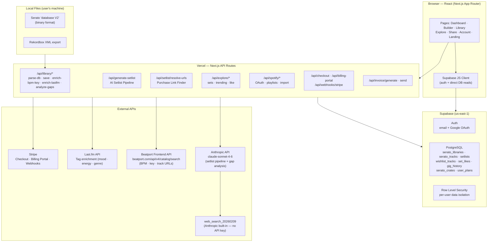

# SetDrop — Full Build Brief
_For YouTube episode scripting. Everything about what was built, how it works, and what makes it interesting._

---

## What Is SetDrop?

SetDrop is an AI-powered DJ setlist planning tool. A DJ uploads their music library, describes their gig (venue, crowd, lineup slot, genre, duration), and the app generates a complete, ordered setlist with harmonic mixing notes, energy arc, and transition cues — all grounded in the tracks they actually own.

**The problem it solves:** DJs currently build setlists by memory and intuition alone. There's no tool that looks at your actual library, understands music theory (harmonic mixing, BPM ranges, energy arc), reads real-world context (what's trending, what the venue crowd expects), and produces a professional DJ set. ChatGPT can suggest track names — but it doesn't know what you own, and it can't enforce DJ-specific rules like the Camelot Wheel.

**Stack:** Next.js 15 (App Router) · Supabase · Vercel · Anthropic Claude API · Stripe · Beatport API · Last.fm API

---

## Full Stack Diagram

---

## Features — What Was Built & How

### 1. Library Import (Serato DB V2 Binary Parser)

**What it does:** DJ uploads their Serato `database V2` file. SetDrop parses it server-side and extracts every track — artist, title, BPM, key, genre, file path, play count, date added.

**How it works:**
- `database V2` is a proprietary binary format. There is no official spec. The parser (`/api/library/parse-db`) reads the file as a `Buffer`, walks a length-prefixed tag structure (`OTRK` records, each containing nested tags like `TBPM`, `TKEY`, `TIT2`, `TPE1`), and decodes UTF-16LE strings.
- The parser is read-only — SetDrop never writes to the Serato database.
- After parsing, tracks are deduplicated by artist+title and saved to `serato_tracks` in Supabase.
- Rekordbox XML is also supported via a client-side XML parser (`DOMParser` in the browser).

**Why it's interesting for YouTube:** You're reverse-engineering a proprietary binary format with no documentation. The only reference is community reverse-engineering work from the open-source DJ software community.

---

### 2. Library Enrichment (BPM, Key, Mood Tags)

**What it does:** Fills in missing BPM, musical key, and mood/energy tags for tracks that Serato didn't analyze.

**How it works — two enrichment passes:**

**Pass 1 — Beatport BPM & Key (`/api/library/enrich-bpm-key`):**
- Calls Beatport's own frontend search API (`www.beatport.com/api/v4/catalog/search`) — the same API their website uses, no OAuth required.
- Fuzzy-matches artist + title, scores results by artist and title similarity, returns the best hit's BPM and key.
- This is not a documented public API — it's the endpoint the Beatport website makes requests to, reverse-engineered from browser devtools.

**Pass 2 — Last.fm Tags (`/api/library/enrich-lastfm`):**
- Calls `track.getInfo` on the Last.fm public API.
- Extracts the top user-generated tags (e.g. "afrobeats", "feel-good", "danceable", "dark", "summer").
- These tags replace Spotify's deprecated audio features endpoint (Spotify locked it down in Feb 2026) as the mood/energy signal fed to the AI.

**Why it's interesting:** The Spotify audio features API — the classic ML-powered danceability/energy/valence scores — was shut down. The app had to pivot to a community-tagging approach via Last.fm, which actually works better for niche DJ genres that Spotify's ML never understood.

---

### 3. Wishlist — Spotify Import & Manual Entry

**What it does:** Tracks a DJ doesn't own yet that they want to buy. Can be imported from Spotify playlists or added manually.

**How it works:**
- Spotify OAuth flow (`/api/spotify/auth` → `/api/spotify/callback`) exchanges for an access token, stored in Supabase per-user.
- `/api/spotify/playlists` lists the user's playlists; `/api/spotify/import` pulls tracks from a selected playlist into `wishlist_tracks`.
- Manual entry auto-fills a Beatport search URL from artist + title.
- Wishlist tracks are tagged `status: 'wishlist'` — the AI pipeline is aware of them and can include them in setlists (flagged as "needs download").

---

### 4. The AI Setlist Pipeline — 2 LLM Calls

This is the core of SetDrop. A user fills out a "gig context" form (genre, crowd, venue, duration, lineup slot, energy arc, seed tracks, wordplay theme) and clicks Generate. The pipeline runs two Claude calls.

**Pre-processing (pure code — no LLM):**
`computeLibraryProfile()` runs in code, not AI. It calculates genre distribution percentages, BPM min/max/avg, energy spread (low/mid/high), top artists, key distribution, wishlist count, and basic strengths/gaps. This structured profile is passed to the first LLM call instead of dumping raw track JSON — keeping the prompt small.

**Call 1 — Gig Intel + Set Blueprint (`claude-sonnet-4-6`):**
- System prompt tells the model to use web search before generating the blueprint.
- `tool_choice: 'auto'` — the model decides when to search. Up to 2 web searches using Anthropic's built-in `web_search_20260209` tool (no API key needed, Anthropic executes the search server-side).
- Typical search pattern: (1) search the venue name to understand crowd/vibe, (2) search trending tracks in the primary genre on Beatport.
- After searching, the model calls `generate_gig_blueprint` tool with structured output: `GigIntelReport` (crowd profile, trending genres, BPM range, artists to avoid, context notes) + `SetBlueprint` (phases with track counts, energy targets, BPM ranges, genre guidance).
- Fallback: if the model searched but didn't call the blueprint tool, a second forced call sends the search results as message history and forces the tool call.

**Between calls (pure code):**
`filterTracksForGig()` trims the library from potentially thousands of tracks down to the 200 most relevant, scored by genre match and BPM fit. Seed tracks and wishlist tracks are always pinned in.

**Call 2 — Track Selection & Notes (`claude-sonnet-4-6`, 8192 tokens):**
- Single forced tool call: `select_and_sequence_tracks`.
- Given the blueprint, gig intel, filtered library (200 tracks as JSON), and user preferences.
- Returns ordered tracklist with: `position`, `artist`, `title`, `bpm`, `key`, `energyLevel`, `whyThisTrack`, `transitionNotes`, `harmonicMixingNotes`, `wordplayConnection`, `isWishlistTrack`, platform search URLs.

**DJ-specific rules baked into the system prompt:**
- Harmonic mixing via the Camelot Wheel (compatible keys = same number ±1, or A↔B same number)
- BPM tolerance per genre: Hip Hop ±5, House ±3, Afrobeats ±8, R&B ±10
- No same artist within 3 consecutive tracks
- No two tracks with BPM±2 AND same key back-to-back
- Opener: energy starts 2–4, peaks at 7 max. Headliner: starts 5+, peaks 9–10
- "Recently played" tracks passed in and excluded
- Seed tracks guaranteed to appear in the set

**Wordplay feature:**
A hip-hop DJ technique where a specific word/phrase is bridged lyrically across consecutive tracks. The model identifies tracks where the word appears in a usable position (hook, chorus, drop) and sequences them consecutively, describing the exact lyrical handoff in `wordplayConnection`.

---

### 5. Purchase Link Resolution (`/api/setlist/resolve-urls`)

**What it does:** After a setlist is generated, SetDrop finds actual purchase/download links for every track — Beatport track pages and pool platform pages (BPM Supreme, Traxsource, DJcity).

**How it works:**
- **Beatport:** Direct call to `beatport.com/api/v4/catalog/search`, fuzzy-scored, returns a real `/track/artist-title/id` URL.
- **BPM Supreme / Traxsource / DJcity:** These platforms have no public APIs. For wishlist tracks, SetDrop uses `web_search_20260209` with `allowed_domains` restricted to each platform's domain. Anthropic searches, returns result URLs. SetDrop checks whether a URL was returned (= found) vs. not (= not on that platform).
- Wishlist tracks get all three pool searches run in parallel; regular library tracks only get Beatport.
- Confidence display: green = verified URL found, yellow = likely match, red = not found on that platform.

**Why it's interesting:** Three DJ download pools (BPM Supreme, Traxsource, DJcity) all have no public API. The only way to check if a track is available is to search. Instead of scraping (brittle, legally questionable), the app uses Anthropic's web search as a managed search layer — Anthropic handles the request, returns result URLs, and the app reads them without touching the site directly.

---

### 6. Setlist Output & Public Share

**What it does:** The generated setlist is displayed as an interactive track list with energy arc visualization, per-track notes, and purchase links. It can be saved and shared via a public URL.

**How it works:**
- Setlist is stored in `setlists` table with `tracks_json` as the source of truth (a single JSONB column holding the full track array). There is no separate junction table — `tracks_json` is canonical.
- Public share URLs: `/set/[slug]` — the slug is generated as `kebab-case-name-xxxxx` (5 random chars). Shares bypass RLS using a Supabase admin client (service role key), allowing unauthenticated reads of public sets.
- **"Built with SetDrop" badge:** Embedded SVG badge (168×24px, dark background, amber text) for creators to embed in blog posts or social media. The share page shows HTML and Markdown embed code that generates this badge linking back to the set.

---

### 7. Explore — Community Set Feed

**What it does:** Browse publicly shared setlists from other DJs. Filter by genre, lineup slot, crowd context. Like sets.

**How it works:**
- `/api/explore/sets` reads `setlists` where `is_public = true` and `share_url IS NOT NULL`. Filters applied server-side for genre, slot, and crowd context.
- Like counts are fetched from `set_likes` and merged in-memory (a map from setlist_id to count), then sorted client-side for "popular" sort mode.
- Viewer's own likes are fetched from `set_likes` filtered by `user_id`, returned as a set of IDs for fast `O(1)` liked-state lookup in the frontend.
- Community features are opt-in. Sets are private by default; public sharing requires an explicit toggle.

---

### 8. Library Intelligence — Gap Analysis

**What it does:** Analyzes the BPM distribution of a DJ's library per genre, detects "holes" (BPM ranges with too few tracks), and uses live web search to recommend specific tracks to buy to fill those gaps.

**How it works — two phases:**

**Phase 1 — Pure code gap detection (`/api/library/analyze-gaps`):**
- Groups all `serato_tracks` by genre.
- Skips genres with fewer than 10 tracks.
- Calculates the 10th–90th percentile BPM range for each genre (using percentiles instead of min/max to ignore outliers — a House DJ who has one 70 BPM track doesn't mean 70 BPM is part of their House range).
- Divides the active range into BPM buckets: 60–79, 80–99, 100–109, 110–119, 120–127, 128–134, 135+.
- Finds buckets with <30% of the genre's average bucket density.
- Severity: `high` (zero tracks, genre is dense), `medium` (zero tracks), `low` (sparse but not empty).
- Returns top 5 gaps sorted by severity.

**Phase 2 — AI trend lookup (`claude-sonnet-4-6` + `web_search_20260209`):**
- Sends the detected gaps to Sonnet with `tool_choice: 'auto'`.
- Model searches "trending [genre] [BPM range] 2026 Beatport" for each gap (up to 3 searches).
- Calls `report_library_gaps` tool with specific artist/title/BPM recommendations per gap.
- Same two-phase call pattern as the blueprint: auto → forced fallback if model searched but didn't call the tool.

**Why haiku doesn't work here:** `web_search_20260209` + custom tools in the same call requires "programmatic tool calling" — only Sonnet supports it. Haiku can use web search alone, but not alongside user-defined tools.

**Dashboard integration:**
- One-click "Analyze Library" button.
- Shows severity-tagged gap cards (red/amber/muted).
- Each recommendation has a "+ Wishlist" button that writes directly to `wishlist_tracks` and updates the Wishlist count card inline.
- Displays metadata: "Analyzed X tracks across Y genres" so the user can confirm it ran.

---

### 9. Serato Crate Export

**What it does:** Exports a generated setlist as a `.crate` file that Serato DJ Pro reads natively — the DJ opens Serato and the set appears as a pre-built crate.

**How it works:**
- `.crate` is another proprietary binary format. SetDrop writes it from scratch: 4-byte magic header `vrsn`, big-endian length-prefixed tag structure, `OSRT` (sort column), `OVCT` (column headers), and one `OTRK` record per track pointing to the file path on the DJ's machine.
- File paths come from `file_path` stored in `serato_tracks` during the Serato DB parse — the full path as Serato recorded it (e.g. `/Users/kel/Music/DJ/House/track.mp3`). This only works on the same machine the library was imported from.
- Written only to `Subcrates/` — never modifying the root Serato library folder.
- Downloaded as a binary file in the browser via a Blob URL.

---

### 10. Billing — Stripe Integration

**What it does:** Free plan (5 sets/month) and Pro plan ($12/month, 50 sets/month). Checkout, customer portal, and usage enforcement.

**How it works:**
- `/api/checkout` creates a Stripe Checkout session and redirects the user.
- `/api/billing-portal` creates a Customer Portal session for managing subscriptions.
- `/api/webhooks/stripe` handles `checkout.session.completed` and `customer.subscription.*` events, updating `user_plans` in Supabase.
- Invoice generation (PDF) via `/api/invoice/generate` — generates invoices for Pro users, no payment processing handled in-app (Stripe handles everything).

---

## The `web_search_20260209` Tool — How It Actually Works

This is one of the most technically interesting parts of the build and worth explaining in detail on YouTube.

**What it is:** A first-party tool provided by Anthropic. Unlike external search APIs (Serper, Tavily, Bing), there's no API key, no separate service, and no external HTTP call from your code. You declare the tool in your Anthropic API call, and Anthropic executes the search on their infrastructure.

**How it appears in the response:** The model's response includes `WebSearchToolResultBlock` and `ServerToolUseBlock` content blocks alongside regular text and tool_use blocks. The search results content is encrypted/opaque — you can't read the search result text. But the `url` field on each result is accessible, which is enough to verify whether a track was found on a platform.

**`allowed_domains`:** You can restrict searches to specific domains (e.g. `allowed_domains: ["www.beatport.com"]`). This is how the pool verification works — it forces the search to only look on that platform.

**`tool_choice: 'auto'` vs. `'any'` vs. `{ type: 'tool', name }`:**
- `auto` — model decides whether to search and when to stop. Used for gig intel (model searches 0–2 times before generating blueprint).
- `any` — forces at least one tool call. Used in pool verification (forces the search to happen).
- `{ type: 'tool', name }` — forces a specific tool. Used in the fallback second call.

**The two-phase pattern:**
Because `tool_choice: 'auto'` doesn't guarantee the model will call your structured output tool in the same response (it might search, then stop), the pipeline uses a fallback: if the response contains search results but no blueprint/gap tool call, the app sends a second request with the search results as message history and forces the tool call. This is how you reliably get both fresh web context AND structured output.

---

## Interesting Technical Decisions (YouTube Talking Points)

### "Why not just use the ChatGPT plugin / Claude Projects?"
You can paste your library into any LLM and ask for a setlist. What you can't get: harmonic mixing enforcement (Camelot Wheel), per-genre BPM tolerance rules, energy arc with opener/headliner rules, recently-played avoidance, seed track pinning, purchase links across four platforms, Serato crate export, and a shareable URL. The rules are why this is an app and not a chat prompt.

### The Spotify Audio Features problem
The original plan was to use Spotify's audio features endpoint (danceability, energy, valence, tempo) as the mood signal. Spotify deprecated it for third-party apps in February 2026. The pivot to Last.fm community tags actually turned out better — tags like "afrobeats", "danceable", "summer vibe" are more semantically useful to a DJ than a float from 0–1. Human-labeled > ML-inferred for niche music.

### The Beatport "public API"
Beatport doesn't have a public API. But their website makes fetch calls to `https://www.beatport.com/api/v4/catalog/search` — the same endpoint SetDrop uses. This is a common pattern: use the same API the website itself uses. It works without OAuth and returns clean JSON. The risk is it changes without notice; the benefit is it reflects the actual current catalog.

### Serato binary format reverse-engineering
No official spec exists. The Serato binary format was reverse-engineered from community documentation (open-source projects like `crate-digger` and `serato-dj-pro-rs`). The crate export required writing binary output from scratch in Node.js — constructing the exact byte sequences that Serato expects.

### Why `tracks_json` instead of a relational junction table
Early versions of the schema used a `setlist_tracks` junction table (one row per track per setlist). This was replaced with a single `tracks_json` JSONB column. Reason: the AI generates a track object with 12+ fields (position, bpm, key, energyLevel, whyThisTrack, transitionNotes, etc.). Normalizing this into columns would require 12+ columns with mostly nullable data. JSONB stores the full rich output without schema migrations every time a new field is added. The setlist is also always read as a whole — no use case for querying individual track fields across setlists.

### Library Intelligence percentile BPM bucketing
The naive approach (min/max BPM range per genre) fails for DJs who have a few outlier tracks in a genre. A House DJ who bought one 70 BPM downtempo track shouldn't have their active BPM range pegged at 70. Using the 10th–90th percentile range means the algorithm measures the genre as the DJ actually uses it, not including edge cases.

---

## Data Schema Overview (Key Tables)

| Table | Purpose | Key Columns |
|---|---|---|
| `serato_libraries` | One per user | `user_id`, `total_tracks`, `last_synced` |
| `serato_tracks` | Full library | `bpm`, `key`, `genre`, `artist`, `title`, `file_path`, `lastfm_tags`, `in_library` |
| `setlists` | Generated sets | `tracks_json` (source of truth), `primary_genre`, `lineup_slot`, `crowd_context`, `share_url`, `is_public` |
| `wishlist_tracks` | Tracks to buy | `artist`, `title`, `bpm`, `beatport_search_url`, `bpm_supreme_search_url`, `djcity_search_url`, `status` |
| `set_likes` | Community likes | `user_id`, `setlist_id` — RLS enabled |
| `gig_history` | Past gigs | `gig_name`, `gig_date`, `venue`, `played_at` |
| `user_plans` | Billing | `plan` (free/pro), `sets_used_this_month`, `stripe_customer_id` |
| `trending_cache` | Chart data cache | `genre` (PK), `tracks` (JSONB), `fetched_at` — global, 24h TTL |

---

## API Routes Map

| Route | Method | What It Does |
|---|---|---|
| `/api/generate-setlist` | POST | Full AI pipeline (library profile → blueprint → track selection) |
| `/api/library/parse-db` | POST | Parse Serato `database V2` binary → track array |
| `/api/library/save` | POST | Save/sync tracks to Supabase |
| `/api/library/enrich-bpm-key` | POST | Beatport BPM + key lookup for tracks missing data |
| `/api/library/enrich-lastfm` | POST | Last.fm tag enrichment |
| `/api/library/analyze-gaps` | GET | BPM gap detection + AI trend recommendations (genre-aware source routing) |
| `/api/dashboard/trending-charts` | GET | Top 5 trending tracks per user's top 3 genres, 24h cached |
| `/api/setlist/resolve-urls` | POST | Beatport URL + pool platform link finder |
| `/api/explore/sets` | GET | Community set feed (filter + paginate) |
| `/api/explore/trending` | GET | Trending tracks across public sets |
| `/api/explore/like` | POST | Toggle like on a set |
| `/api/spotify/auth` | GET | Initiate Spotify OAuth |
| `/api/spotify/callback` | GET | Exchange Spotify auth code |
| `/api/spotify/import` | POST | Import Spotify playlist → wishlist |
| `/api/wishlist/lookup-beatport` | POST | Auto-fill Beatport search URL for manual wishlist entry |
| `/api/checkout` | POST | Stripe Checkout session |
| `/api/billing-portal` | POST | Stripe Customer Portal session |
| `/api/webhooks/stripe` | POST | Handle subscription events |
| `/api/invoice/generate` | POST | Generate PDF invoice |

---

### 11. Trending by Genre — Dashboard Card

**What it does:** The Dashboard auto-loads the top 5 currently trending tracks in each of the DJ's top 3 library genres. Each genre links to the chart source where the data came from, and tracks can be added to the wishlist in one click.

**How it works:**
- On Dashboard mount, a `useEffect` fires a GET to `/api/dashboard/trending-charts`.
- The route queries `serato_tracks` to find the user's top 3 genres by track count.
- It checks `trending_cache` (a global Supabase table) for each genre. If a cache entry exists and is less than 24 hours old, it's returned instantly — no AI call.
- For any genre without a fresh cache entry, it calls `claude-sonnet-4-6` with `web_search_20260209` and a `report_trending_tracks` structured output tool.
- Results are upserted into `trending_cache` and returned. The next user (or same user the next day) who has that genre will get the cached result.
- The "Updated Xh ago" timestamp in the card header shows the age of the oldest cache entry across the displayed genres.

**Genre-to-source routing (why this matters):**
Beatport is the right source for House and Techno, but wrong for Hip Hop (Beatport's Hip Hop catalog is mostly instrumental DJ edits, not mainstream). The system prompt maps each genre family to its correct chart platform:

| Genre | Source |
|---|---|
| House / Tech House / Techno / D&B | Beatport Top 100 (genre chart) |
| Hip Hop / Trap / Drill | DJcity charts or Billboard Hot Rap Songs |
| R&B / Soul | Billboard Hot R&B/Hip-Hop or DJcity R&B |
| Pop / Top 40 | Billboard Hot 100 |
| Latin / Reggaeton | Billboard Latin Charts |
| Afrobeats / Dancehall | Audiomack Trending or Apple Music Afrobeats |
| EDM / Big Room | Beatport Top 100 Big Room or Billboard Dance/Electronic |

This same mapping was also applied to Library Intelligence gap recommendations — so when the gap detector finds you're missing House at 128 BPM, it searches Beatport; when it finds you're missing Hip Hop at 95 BPM, it searches DJcity or Billboard.

**The caching design:** `trending_cache` is a global table (not per-user). The `genre` column is the primary key. This means all users share the same cache — if User A triggers a fresh fetch for "Hip Hop", User B with Hip Hop in their library gets that result immediately without another AI call. Cost scales with the number of distinct genres across all users, not the number of users.

---

### 12. Security — Row Level Security on `set_likes`

**What was fixed:** Supabase's security advisor flagged `set_likes` as a public table with RLS disabled — meaning anyone with direct PostgREST access could read, insert, or delete any like row without authentication.

**Fix applied:** RLS was enabled with three policies:
- `SELECT`: public (like counts are shown on the Explore page to all visitors)
- `INSERT`: authenticated users can only insert rows where `user_id = auth.uid()`
- `DELETE`: users can only delete their own likes

None of the app routes were affected because all `set_likes` operations already went through `createAdminClient()` (service role key), which bypasses RLS. The policies protect against direct API/PostgREST access only.

**Note for the video:** This is a good moment to explain the Supabase security model: the anon key respects RLS, the service role key bypasses it. If you accidentally expose the anon key in client-side code and RLS isn't set up, your entire table is public. The `trending_cache` table was given RLS + public SELECT at creation time to avoid the same issue.

---

## YouTube Episode Angles

### Angle 1: "I gave Claude 10,000 music files and this happened"
Lead with the end result — show a full setlist generated with harmonic mixing notes, energy arc, transitions. Then reveal the architecture underneath. Good hook but slightly misleading (you're not feeding raw audio).

### Angle 2: "Building a real SaaS with the Anthropic API — what nobody tells you"
Focus on the technical decisions: the two-phase tool_choice pattern, why haiku vs. sonnet matters, the web_search tool, what happened when Spotify killed their API. More developer-focused.

### Angle 3: "I reverse-engineered Serato's binary format to build a DJ AI tool"
Lead with the Serato parser story — proprietary binary format, no documentation, community reverse-engineering. This is genuinely impressive to both developers and DJs.

### Angle 4: "This AI tool knows your DJ library better than you do"
Lead with Library Intelligence — show the gap analysis output, the specific track recommendations. Most accessible for DJ/music creator audience.

### The differentiation argument (use this in any angle)
The key argument against "why not just use ChatGPT": Claude doesn't know which of 10,000 tracks you actually own. It doesn't enforce Camelot Wheel. It doesn't know you played that track at your last gig. It can't export a Serato crate. The rules, the context, and the integrations are what make this an app instead of a chat window.
